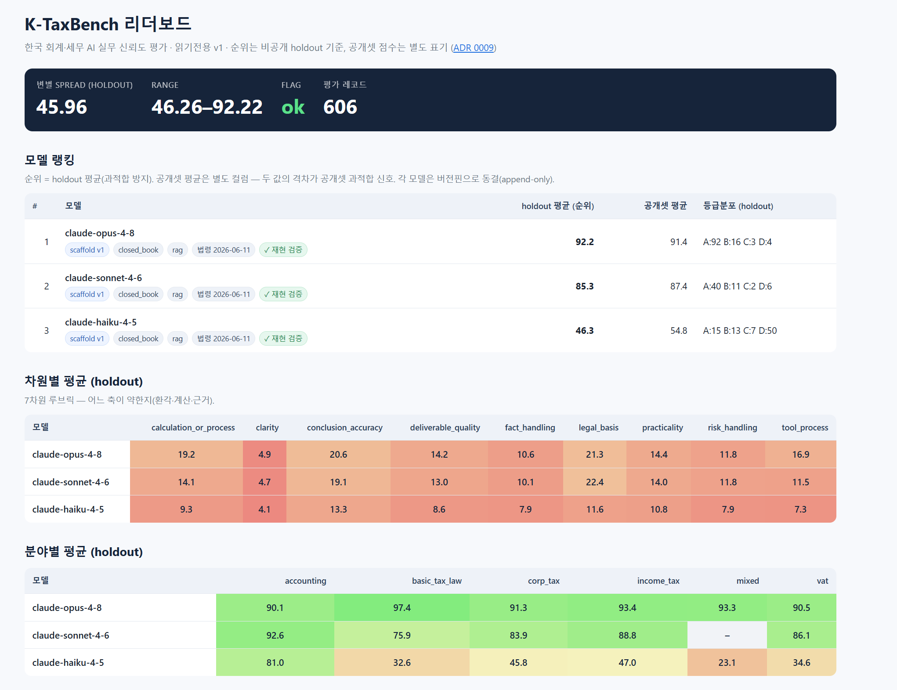

# K-TaxBench

한국 회계·세무 AI가 “그럴듯하게 말하는지”가 아니라 **실무 검증을 통과할 수 있는지** 평가하는 벤치마크입니다.

K-TaxBench는 한국 세법·회계기준 기반 문항, 근거 인용 검증, 계산 채점, LLM-judge 루브릭, agent 도구 사용 검증, 공개 리더보드 정책을 하나의 평가 파이프라인으로 묶었습니다.

**Live:** [tax-benchmark.askewly.com](https://tax-benchmark.askewly.com)  
**Public sample:** [data/sample-questions-v0.1.jsonl](data/sample-questions-v0.1.jsonl)  
**Technical report:** [docs/m4-tech-report-en.md](docs/m4-tech-report-en.md)



## 왜 만들었나

회계·세무 AI는 일반 LLM 벤치마크에서 잘 드러나지 않는 방식으로 실패합니다.

- 존재하지 않는 조문이나 기준서를 인용함
- 개정 전 세법을 최신 규정처럼 답함
- 계산 과정은 그럴듯하지만 세액·한도·기한을 틀림
- 불확실한 사안을 단정적으로 안내함
- 도구를 썼다고 말하지만 실제 근거 조회와 답변이 연결되지 않음

K-TaxBench는 이런 실패 모드를 한국 부가가치세, 법인세, 소득세, 국세기본법, 회계, 복합 agent workflow 문항으로 분해해 측정합니다.

## 구현한 것

- 공개/비공개 visibility를 가진 한국 회계·세무 벤치마크 스키마
- `closed_book`, `rag`, `agent`, `agent_forced` 평가 실행기
- 객관식·계산·법령 인용·K-IFRS 기준서-문단 인용을 위한 결정론 채점기
- LLM-judge 호출 실패를 0점과 분리하는 집계 안전장치
- 비공개 holdout 순위와 공개 샘플 점수를 분리한 리더보드 payload
- private holdout이 공개 번들에 섞이면 실패하는 release gate
- 정적 Next.js 리더보드 UI

## 평가하는 능력

- 한국 세법·회계기준의 정확한 이해
- 법령 조문과 K-IFRS 기준서-문단 근거 인용
- 세액·한도·신고기한 등 계산형 판단
- 리스크와 추가 확인사항을 구분하는 실무 커뮤니케이션
- tool-grounded agent 답변에서 “조회한 근거”와 “최종 인용”의 일치 여부

## 공개 상태

- 이 public repository에는 공개 가능한 샘플 문항만 포함합니다.
- [data/sample-questions-v0.1.jsonl](data/sample-questions-v0.1.jsonl): `public_sample` 43문항
- [leaderboard/public/data/public/release.jsonl](leaderboard/public/data/public/release.jsonl): canary 포함 공개 release bundle
- 리더보드 순위는 private holdout 집계 기준입니다.
- holdout 문항의 본문, 정답, id는 공개하지 않습니다.

이 저장소는 포트폴리오 공개용 snapshot입니다. 전체 holdout set과 raw model outputs는 별도의 private 운영 저장소에서 관리합니다.

## 구조

```text
src/ktaxbench/
  loader.py              # JSONL 문항 로더
  prompts.py             # closed_book / rag / agent prompt builder
  runner.py              # 모델 실행과 run record 생성
  grading/               # 결정론 채점기 + LLM judge 연동
  report.py              # 집계 리포트와 public leaderboard payload

data/
  sample-questions-v0.1.jsonl   # public_sample only

leaderboard/
  app/                   # Next.js static leaderboard UI
  data/                  # public-safe aggregate payload
  public/data/public/    # public release bundle

docs/
  adr/                   # 설계 의사결정
  findings/              # 평가 결과와 분석
  benchmark-schema.md    # 문항 스키마
  rubric-v0.1.md         # 채점 루브릭
```

## 빠른 실행

```bash
uv sync --extra dev
uv run python scripts/validate_questions.py data/sample-questions-v0.1.jsonl
uv run pytest
uv run python scripts/run_eval.py --models claude-haiku-4-5 --modes closed_book --limit 5
```

## 내 모델 테스트와 제출

외부 사용자는 공개 샘플로 본인 LLM/RAG/agent를 로컬에서 self-test할 수 있습니다. 공식 leaderboard 순위는 공개 샘플이 아니라 maintainer가 private holdout으로 재현 채점한 결과만 사용합니다.

```bash
uv run python scripts/run_eval.py \
  --models your-model-name \
  --modes closed_book,rag \
  --data data/sample-questions-v0.1.jsonl \
  --out outputs/results

uv run python scripts/make_report.py outputs/results/*.jsonl --out outputs/report.md
```

모델 연결 방식, provider 설정, 제출 metadata는 [docs/submission-guide.md](docs/submission-guide.md)에 정리했습니다.

## 공개 번들 재현

```bash
uv run python scripts/package_release.py \
  --data data/sample-questions-v0.1.jsonl \
  --out dist/public-release-v1.0 \
  --version 1.0 \
  --accessed-at 2026-06-14 \
  --seed 42
```

release gate는 `public_sample`이 아닌 문항이나 공개 허용 license가 없는 문항이 섞이면 실패합니다.

## 주요 설계 문서

- 리더보드 순위는 private holdout 기준: [ADR 0009](docs/adr/0009-leaderboard-submission-policy.md)
- agent 평가 격리: [ADR 0008](docs/adr/0008-agent-eval-isolation.md)
- 법령/K-IFRS citation grader: [ADR 0007](docs/adr/0007-citation-grader-kifrs-paragraph.md)
- 공개 샘플 범위와 canary 전략: [docs/m4-public-sample-scope.md](docs/m4-public-sample-scope.md)

## Public/Private Boundary

이 public snapshot은 private holdout이나 local credential을 포함하지 않도록 정리했습니다.

```bash
git ls-files | rg "^(data/private/|outputs/|CLAUDE\.local\.md)"
rg -n -i "(api[_-]?key|secret|token|password|bearer|sk-[A-Za-z0-9]|ghp_|github_pat_|ANTHROPIC_API_KEY|OPENAI_API_KEY|GEMINI_API_KEY|DATABASE_URL)" --glob "!.git/**" --glob "!.venv/**" --glob "!uv.lock"
```

---

# English

K-TaxBench is a Korean accounting and tax benchmark for evaluating whether an AI system can pass practical verification, not just produce fluent answers.

It combines domain-specific question design, statute/K-IFRS grounding, deterministic citation and calculation checks, LLM-judge rubrics, tool-grounded agent evaluation, and a public leaderboard policy that separates practice data from the private ranking holdout.

**Live:** [tax-benchmark.askewly.com](https://tax-benchmark.askewly.com)  
**Public sample:** [data/sample-questions-v0.1.jsonl](data/sample-questions-v0.1.jsonl)  
**Technical report:** [docs/m4-tech-report-en.md](docs/m4-tech-report-en.md)

## Why It Exists

Accounting and tax AI fails in ways generic benchmarks do not measure well: fake legal citations, stale statute assumptions, incorrect tax calculations, overconfident risk advice, and tool-use claims that are not grounded in actually retrieved authority.

K-TaxBench turns those failure modes into an evaluation harness for Korean VAT, corporate tax, income tax, basic tax law, accounting, and mixed agent workflows.

## What I Built

- A structured Korean accounting/tax benchmark schema with public/private visibility routing
- A Python evaluation runner for `closed_book`, `rag`, `agent`, and `agent_forced` modes
- Deterministic graders for multiple-choice, calculations, statute citations, and K-IFRS standard-paragraph references
- LLM-judge integration with explicit judge-failure handling and aggregation safeguards
- A public-safe leaderboard payload and static Next.js leaderboard UI
- A release pipeline that blocks private holdout leakage into public sample bundles

## Current Public State

- Public sample data: [data/sample-questions-v0.1.jsonl](data/sample-questions-v0.1.jsonl)
- Public sample rows in this repository: 43 `public_sample` questions
- Official release bundle: [leaderboard/public/data/public/release.jsonl](leaderboard/public/data/public/release.jsonl)
- Private holdout questions are intentionally not tracked in this public repository
- Leaderboard ranking is based on private holdout aggregates; holdout question text, answers, and ids are not exposed

## Quickstart

```bash
uv sync --extra dev
uv run python scripts/validate_questions.py data/sample-questions-v0.1.jsonl
uv run pytest
uv run python scripts/run_eval.py --models claude-haiku-4-5 --modes closed_book --limit 5
```

## Test Your Own Model

External users can run local self-tests on the public sample. Official leaderboard rankings are based only on maintainer-reproduced private holdout runs, not public sample scores.

```bash
uv run python scripts/run_eval.py \
  --models your-model-name \
  --modes closed_book,rag \
  --data data/sample-questions-v0.1.jsonl \
  --out outputs/results

uv run python scripts/make_report.py outputs/results/*.jsonl --out outputs/report.md
```

See [docs/submission-guide.md](docs/submission-guide.md) for provider setup, custom model adapters, result files, and required submission metadata.

## Key Design Decisions

- Ranking uses private holdout aggregates only: [ADR 0009](docs/adr/0009-leaderboard-submission-policy.md)
- Agent evaluation is isolated from repository-local prompts and MCP state: [ADR 0008](docs/adr/0008-agent-eval-isolation.md)
- Citation grading supports both legal articles and K-IFRS standard-paragraph references: [ADR 0007](docs/adr/0007-citation-grader-kifrs-paragraph.md)
- Public sample scope and canary strategy are documented in [docs/m4-public-sample-scope.md](docs/m4-public-sample-scope.md)
